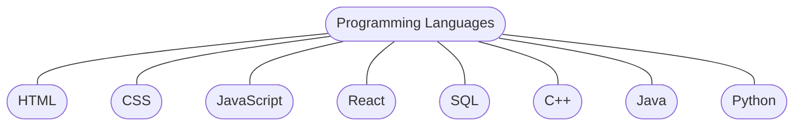

# practice_code

### Coding Problems

### Programming Languages

```mermaid
graph TD;
    A([Programming Languages])---B([HTML]);
    A([Programming Languages])---C([CSS]);
    A([Programming Languages])---D([JavaScript]);
    A([Programming Languages])---E([React]);
    A([Programming Languages])---F([SQL]);
    A([Programming Languages])---G([C++]);
    A([Programming Languages])---H([Java]);
    A([Programming Languages])---I([Python]);
    
    
    click B "https://github.com/Curious-Yu/practice_code/wiki/HTML" "Open this in a new tab" _blank
    click C "https://github.com/Curious-Yu/practice_code/wiki/CSS" "Open this in a new tab" _blank
    click D "https://github.com/Curious-Yu/practice_code/wiki/JavaScript" "Open this in a new tab" _blank
    click E "https://github.com/Curious-Yu/practice_code/wiki/React" "Open this in a new tab" _blank
    click F "https://github.com/Curious-Yu/practice_code/wiki/SQL" "Open this in a new tab" _blank
    click G "https://github.com/Curious-Yu/practice_code/wiki/C_plus_plus" "Open this in a new tab" _blank
    click H "https://github.com/Curious-Yu/practice_code/wiki/Java" "Open this in a new tab" _blank
    click I "https://github.com/Curious-Yu/practice_code/wiki/Python" "Open this in a new tab" _blank
    
```
