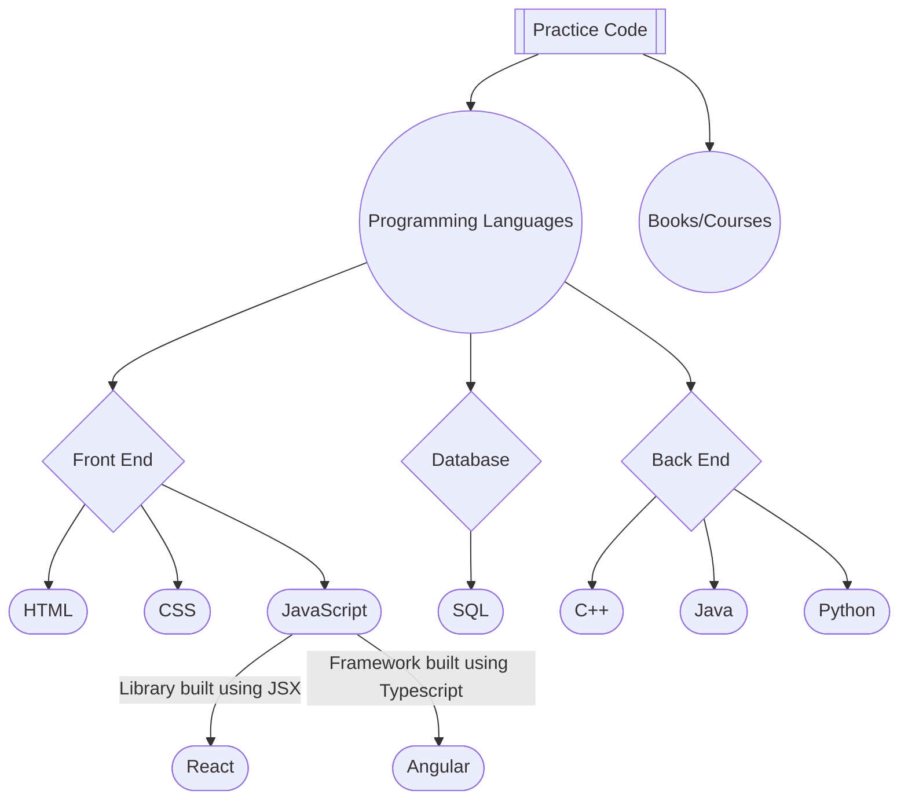

# Practicing Codes

```mermaid
graph TD;

    A1[[Practice Code]]-->B1((Programming Languages));
    A1[[Practice Code]]-->B2((Books/Courses));
    
    B1-->C1{Front End};
    B1-->C2{Database};
    B1-->C3{Back End};
    

    C1-->D1([HTML]);
    C1-->D2([CSS]);
    C1-->D3([JavaScript]);
    
    D3-- Library built using JSX -->E1([React]);
    D3-- Framework built using Typescript -->E2([Angular]);
    
    C2-->D4([SQL]);
    
    C3-->D5([C++]);
    C3-->D6([Java]);
    C3-->D7([Python]);
    
    click A1 "https://github.com/Curious-Yu/practice_code" _blank
    
    click D1 "Curious-Yu/practice_code#html" _blank
    click D2 "Curious-Yu/practice_code#css" _blank
    click D3 "Curious-Yu/practice_code#javascript" _blank
    
    click E1 "Curious-Yu/practice_code#react" _blank
    click E2 "Curious-Yu/practice_code#angular" _blank
    
    click D4 "Curious-Yu/practice_code#sql" _blank
    
    click D5 "Curious-Yu/practice_code#cplusplus" _blank
    click D6 "Curious-Yu/practice_code#java" _blank
    click D7 "Curious-Yu/practice_code#python" _blank
    

    
```

# HTML

# CSS

# JavaScript

# React

# Angular

# SQL

# Cplusplus (C++)

# Java

# Python

