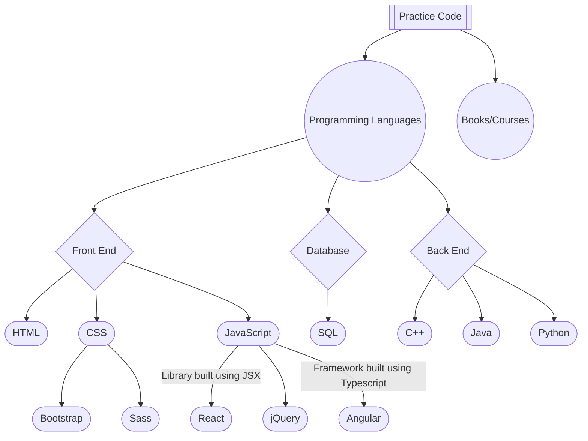

# Practicing Codes

# HTML

HTML is the standard markup language for creating Web pages.

 

# CSS

CSS is the language we use to style a Web page.

CSS describes how HTML elements should be displayed.

 

# Bootstrap

Bootstrap is the world's most famous free CSS framework.

 

# SASS

Sass is a CSS pre-processor.

Sass reduces repetition of CSS and therefore saves time.

 

# JavaScript

JavaScript is the Programming Language for the Web.

JavaScript can update and change both HTML and CSS.

JavaScript can calculate, manipulate and validate data.

 

# React

React is a JavaScript library created by Facebook.

React is a User Interface (UI) library.

React is a tool for building UI components.

 

# jQuery

jQuery is a JavaScript Library.

jQuery greatly simplifies JavaScript programming.

 

# Angular

AngularJS lets you extend HTML with HTML attributes called directives.

AngularJS directives offers functionality to HTML applications.

AngularJS provides built-in directives and user defined directives.

 

# SQL

SQL is a standard language for accessing and manipulating databases.

 

# Cplusplus

C++ is used to create computer programs, and is one of the most used language in game development.

C++ is a cross-platform language that can be used to create high-performance applications.

C++ gives programmers a high level of control over system resources and memory.

 

# Java

It is used for:

- Mobile applications (specially Android apps)
- Desktop applications
- Web applications
- Web servers and application servers
- Games
- Database connection

 

# Python

It is used for:

- web development (server-side)
- software development
- mathematics
- system scripting

 

# Resources

Coding Interview Preps

    
- [Editing Learning Algorithms in JavaScript from Scratch Udemy](https://github.com/Curious-Yu/practice_code/wiki/Learning-Algorithms-in-JavaScript-from-Scratch---Udemy)
    
- [JavaScript Algorithms and Data Structures Freecodecamp](https://github.com/Curious-Yu/practice_code/wiki/JavaScript-Algorithms-and-Data-Structures---Freecodecamp)
    
- [Cracking the Coding Interview - Javascript](https://github.com/careercup/CtCI-6th-Edition-JavaScript)

- [Front End Development Libraries FreeCodeCamp](https://github.com/Curious-Yu/practice_code/wiki/Front-End-Development-Libraries---FreeCodeCamp)

